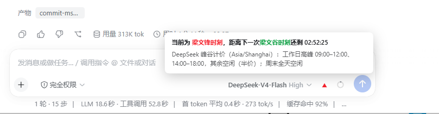
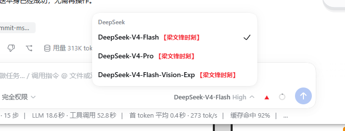

# dsh-liangwenfeng-moment

DeepSeek Harness 插件：在**对话窗口右下角“切换模型”区域**，实时显示 DeepSeek 的波峰 / 波谷时刻。

- 当前是**波峰**（高峰计价时段）→ 模型按钮右侧显示**红色向上 ▲**（梁文锋时刻）
- 当前是**波谷**（低谷/空闲计价时段）→ 模型按钮右侧显示**绿色向下 ▼**（梁文谷时刻）

跟随 DeepSeek API **峰谷计价**口径（以 DeepSeek 官网公告为准，默认北京时间）：

- 高峰时段（波峰）：周一至周五 `09:00 – 12:00`、`14:00 – 18:00`；
- 其余时间为空闲时段（波谷），价格为高峰时段价格的一半；
- 周末全天按空闲（波谷）计费。

状态约每秒刷新一次，到点自动翻转。

## 效果

对话输入框右下角模型按钮**右侧**常驻彩色箭头（不会像文字后缀那样被按钮的省略号截断）：

```
[ DeepSeek-V3.2 ⌄ ] ▲    ← 波峰（红色向上箭头 = 梁文锋时刻）
[ DeepSeek-V3.2 ⌄ ] ▼    ← 波谷（绿色向下箭头 = 梁文谷时刻，空闲/周末）
```

把鼠标悬浮到模型按钮或箭头上（或键盘聚焦到模型按钮），弹出实时面板，每秒动态倒数：



- 波峰：`当前为 梁文锋时刻，距离下一次梁文谷时刻还剩 hh:mm:ss`
- 波谷：`当前为 梁文谷时刻，距离下一次梁文锋时刻还剩 hh:mm:ss`
- 句子中的时刻名称按文字着色：**梁文锋时刻 → 红色**、**梁文谷时刻 → 绿色**；
- 下方附一行规则说明（时区 / 高峰窗口 / 周末全天空闲）；相位翻转时文案自动切换。

点开切换模型下拉后，DeepSeek 分组内的每个模型同样带时刻后缀（后缀文字也按名称着色）：



## 目录结构

```
dsh-liangwenfeng-moment/
├─ package.json            # Cordis bundle 元数据 + dsh.client 声明
├─ cordis.patch.yml        # 插入 loader entry（默认启用）
├─ src/index.js            # 宿主侧入口（记录启用/禁用）
├─ src/wave.js             # 波峰/波谷相位引擎（纯函数，可单测）
├─ client-src/template.js  # 浏览器端 bundle 外壳
├─ client-src/body.js      # DOM 装饰逻辑（右侧箭头 + 悬浮实时倒计时面板 + 下拉内后缀）
├─ scripts/build-client.mjs
├─ lib/client.js           # 构建产物（模板+wave+body）
├─ pic/                    # README 截图（1.png 悬浮面板 / 2.png 下拉后缀）
└─ test/wave.test.mjs      # 单元测试
```

## 本地开发

```bash
npm install   # 或 pnpm install（只需 @deepseek-ai/schemastery）
node scripts/build-client.mjs   # 改完 src/wave.js 或 client-src/body.js 后重新生成 lib/client.js
node test/wave.test.mjs         # 运行单元测试（10 项）
```

## 安装到 DSH Desktop

1. 打包：`npm pack`（或 `pnpm pack`），得到 `dsh-liangwenfeng-moment-0.1.0.tgz`；
2. 把 tgz 放到 `C:\Users\zhuchao\.dsh\vendor\`；
3. 编辑 `C:\Users\zhuchao\.dsh\profiles\desktop\package.json`：
   - `dependencies` 增加：`"dsh-liangwenfeng-moment": "file:C:/Users/zhuchao/.dsh/vendor/dsh-liangwenfeng-moment-0.1.0.tgz"`
   - `dsh.profile.bundles` 数组末尾追加 `"dsh-liangwenfeng-moment"`；
4. 在 `C:\Users\zhuchao\.dsh\profiles\desktop` 执行 `pnpm install`；
5. **重启 DSH Desktop**（或通过 设置 → 插件 重新加载 loader），再刷新/重开对话窗口。

启用后，右下角模型切换按钮右侧即可看到红 ▲ / 绿 ▼ 时刻箭头（见“效果”一节）。

## 验证是否已生效

```bash
node scripts/verify-install.mjs
```

脚本分两层自检：

- 文件层：vendor tgz、`desktop\package.json` 的依赖与 `dsh.profile.bundles`、
  `node_modules\dsh-liangwenfeng-moment` 及其 `lib/client.js`；
- 运行时层：拉取当前 GUI 首页注入的 `window.__DSH_BOOT__` 启动清单，
  确认包含 `dsh-liangwenfeng-moment`。

运行时层 `FAIL` 表示 DSH Desktop 仍在使用旧组合 —— 完全退出并重开应用
（或 设置 → 插件 里触发一次 loader 重载）后重跑即可。

## 调整规则

波峰/波谷判定默认值集中在两处，保持同步即可：

- 客户端实时判定：`client-src/body.js` 顶部 `LWFG_CONFIG`；
- 配置声明：`src/index.js` 的 `Config` 与 `cordis.patch.yml`。

例如想改成别的时段，把 `LWFG_CONFIG.peakWindows` 改为新的
`[['HH:mm', 'HH:mm'], ...]` 窗口列表，重新 `node scripts/build-client.mjs`
并重装/覆盖 `lib/client.js` 后重载即可。

## 卸载

- 从 `desktop\package.json` 移除依赖与 bundle 条目，删除 vendor 里的 tgz；
- 或直接在 设置 → 插件 中禁用本插件（仅隐藏后缀，不清除文件）。

## 说明

- 只在当前为 **DeepSeek** 系模型时显示箭头/悬浮面板，其他模型不受影响；
- 不修改会话、模型或消息任何数据，纯展示；
- 判峰谷所用“波峰/波谷”与 DeepSeek 官方峰谷计价时段一致（高峰=周一至周五
  09:00–12:00、14:00–18:00，空闲半价，周末全天空闲），具体窗口可自行按最新公告调整。
